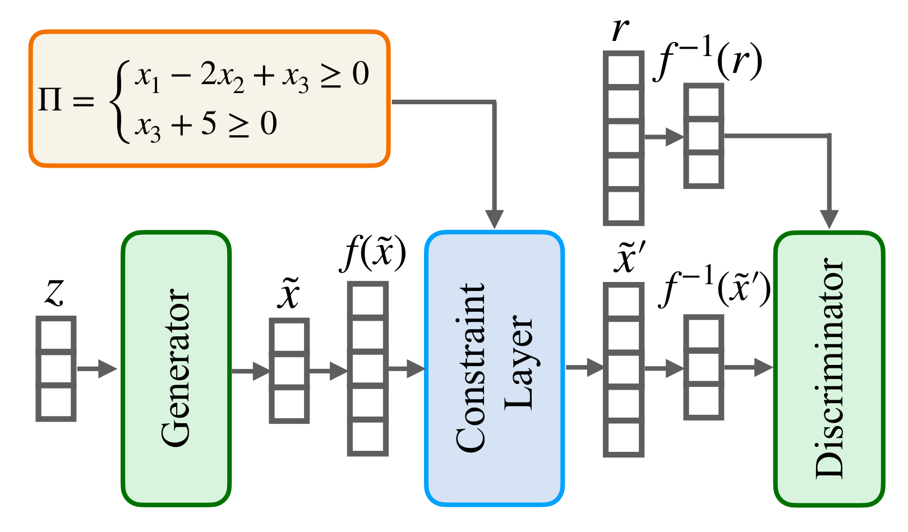

# Constrained DGMs

This repository is built on top of the [repository](https://github.com/mihaela-stoian/ConstrainedDGM) containing the code for the constraint layer proposed in our paper titled "**How Realistic Is Your Synthetic Data? Constraining Deep Generative Models for Tabular Data**", which was accepted for publication at ICLR 2024. 

**Differently from the previous repository, it uses [PiShield](https://github.com/mihaela-stoian/PiShield) for easily integrating the constraint layer into the neural network models.**
To demonstrate how PiShield can be used in the tabular data generation setting, we integrated it into the TableGAN model [1]. 


## Description

Deep Generative Models (DGMs) have been shown to be powerful tools for generating tabular data. 
However, they fail to comply with constraints that encode essential background knowledge on the problem at hand, which is needed to generate realistic synthetic data.
In our paper, we address this limitation and show how DGMs for tabular data can be transformed into **Constrained Deep Generative Models (C-DGMs)**, whose generated samples are guaranteed to be compliant with the given constraints. 
This is achieved by automatically parsing the constraints and transforming them into a Constraint Layer (CL) seamlessly integrated with the DGM, as shown below.

[//]: # ()


If you use this paper, please cite the following:
```
@inproceedings{cdgm2024iclr,
  title = "How Realistic Is Your Synthetic Data? Constraining Deep Generative Models for Tabular Data",
  author = "Mihaela Catalina Stoian and Salijona Dyrmishi and Maxime Cordy and Thomas Lukasiewicz and Eleonora Giunchiglia",
  year = "2024",
  booktitle = "Proceedings of the 12th International Conference on Learning Representations, ICLR 2024, Vienna, Austria, 7--11 May 2024",
  month = "May",
}
```


## Dependencies
````
conda create -n "cdgm" python=3.10 ipython
conda activate cdgm
conda install pytorch torchvision torchaudio cpuonly -c pytorch
pip install sdv
pip install autograd
pip install wandb
pip install synthcity
````
This repository requires [PiShield](https://github.com/mihaela-stoian/PiShield).


## Examples
The Faulty Steel Plates (Faults) dataset is available [here](https://www.kaggle.com/datasets/uciml/faulty-steel-plates).
To download the other datasets, please refer to the appendix of our paper where we detail the datasets we used.

Scripts to split the data into train, validation and testing partitions are available in the `other_helper_scripts` directory of this repository.

### TableGAN

```
use_case="url"
eps=300
default_optimiser="adam"
default_lr=0.0010
default_bs=128
default_random_dim=100
seed=0

# unconstrained
python main_tableGAN.py ${use_case} --seed=$seed --epochs=$eps --optimiser=${default_optimiser} --lr=${default_lr} --batch_size=${default_bs} --random_dim=${default_random_dim}

# constrained
python main_tableGAN.py ${use_case} --seed=$seed --epochs=$eps --optimiser=${default_optimiser} --lr=${default_lr} --batch_size=${default_bs} --random_dim=${default_random_dim} --version="constrained" --label_ordering="corr"
```

**References**

[1] Noseong Park, Mahmoud Mohammadi, Kshitij Gorde, Sushil Jajodia, Hongkyu Park, and Young-min Kim. Data synthesis based on generative adversarial networks. Proceedings of the VLDB
Endowment, 11, 2018.